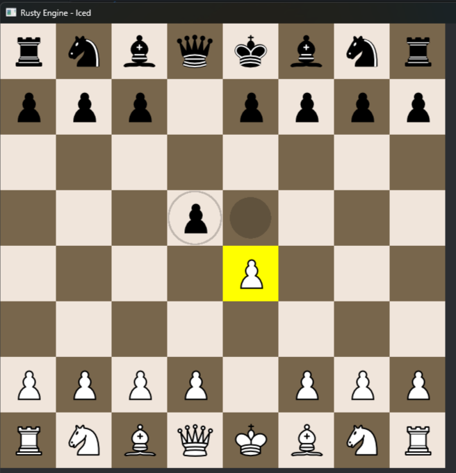

# Rusty Engine

Rusty Engine is a work-in-progress chess engine written in Rust. It combines a
bitboard-based chess core, legal move generation, a stripped-down search
implementation, and an [`iced`](https://iced.rs/) desktop GUI for exploring and
playing positions manually.

The project currently focuses on building a correct and efficient engine
foundation. Engine-versus-player gameplay in the GUI and larger search
optimizations are still in development.



## Features

- Bitboard board representation with separate piece and occupancy masks
- Magic-bitboard lookup tables for rook, bishop, and queen attacks
- Complete legal move generation, including:
  - Checks, pins, and double checks
  - Castling
  - En passant
  - Promotions
- Compact `u32` move encoding
- Reversible make/unmake move handling for recursive search
- FEN position parsing and validation
- Piece-square-table evaluation with opening and endgame values
- Static-depth iterative-deepening negamax search with alpha-beta pruning
- Basic move ordering using the principal variation, promotions, recaptures,
  and captures
- Desktop chessboard built with `iced`
- Perft coverage for the starting position and established edge-case positions

## Quick Start

### Requirements

- A current stable Rust toolchain
- Cargo

Clone the repository and run the application from its root:

```sh
git clone https://github.com/ottofreund/rusty_engine.git
cd rusty_engine
cargo run
```

Run the test suite with:

```sh
cargo test -- --test-threads=1
```

The perft tests search millions of positions and may take noticeably longer
than the other tests.


## Architecture

The engine is split into a few focused layers:

- **`Position`** owns the mutable board state, legal-move storage, move history,
  and the state required to make and unmake moves.
- **`MoveGen`** precomputes attack data and magic-bitboard tables, detects
  checks and pins, and generates legal moves.
- **`Searcher`** contains the iterative-deepening negamax and alpha-beta search
  foundation together with basic move ordering.
- **`Evaluator`** scores positions using piece-square tables, including
  separate pawn and king values for the endgame.
- **`Game`** coordinates the current position, move generator, and searcher.
- **`ui`** renders the board, handles square selection, and loads positions
  through the FEN interface.

Moves are encoded as `u32` values rather than heap-allocated objects. The
encoding stores source and target squares, piece information, and flags for
captures, castling, en passant, double pawn pushes, and promotions.

Sliding-piece attacks use precomputed magic-bitboard lookups. Legal move
generation also tracks attacked squares, pinned pieces, check-blocking squares,
castling rights, and en passant state.

## Testing

The test suite covers:

- Move encoding and decoding
- FEN parsing
- Magic-bitboard attacks compared with naive sliding attacks
- Position evaluation and piece-square-table loading
- Perft validation for the starting position and multiple tactical edge cases

The perft suite exercises castling, checks, pins, en passant, promotions, and
make/unmake correctness at depth.

## Development Status

| Area | Status |
| --- | --- |
| Bitboard board representation | Implemented |
| Complete legal move generation | Implemented and perft-tested |
| FEN position loading | Implemented |
| Make/unmake move support | Implemented |
| Piece-square-table evaluation | Implemented |
| Static-depth negamax and alpha-beta search core | Implemented |
| GUI board and manual play | Implemented |
| Time-controlled search integration | Implemented |
| UCI compatibility for engine vs. engine | Implemented |
| Engine game loop in the GUI | Planned |
| Transposition table | Planned |
| Multithreaded search | Planned |

Rusty Engine is under active development. The current search is intentionally
small and provides a base for stronger evaluation, pruning, caching, time
management, and parallel search.
