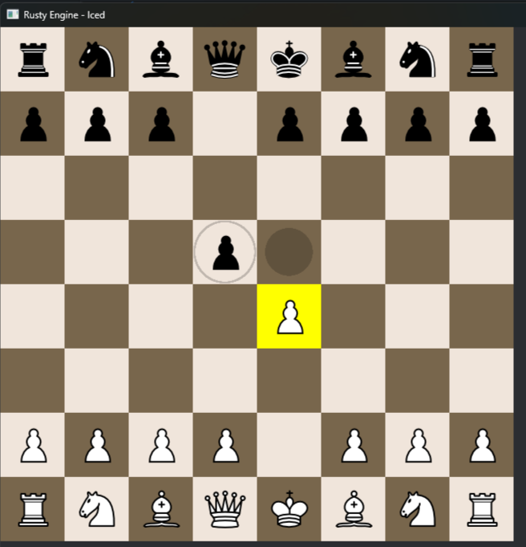

# Rusty Engine

Rusty Engine is a work-in-progress chess engine written in Rust. It combines a
bitboard-based chess core, perft-tested legal move generation, iterative-deepening
alpha-beta search, a UCI command-line interface, and an [`iced`](https://iced.rs/)
desktop GUI.



## Features

- Bitboard board representation and magic-bitboard sliding attacks
- Legal move generation for checks, pins, castling, en passant, and promotions
- Compact `u32` moves, reversible make/unmake state, and FEN loading with
  king-count, castling-right, and en-passant consistency checks
- Incremental Zobrist hashing with threefold repetition and fifty-move-rule
  handling in both games and search
- Material and opening/endgame piece-square evaluation
- Fixed-depth or timed iterative-deepening negamax search with alpha-beta pruning
  and quiescence search
- Principal-variation reuse, a history heuristic, static exchange evaluation,
  and transposition-table move ordering and cutoffs
- A configurable 16 MB-by-default, cache-line-aligned, clustered transposition
  table with depth-, bound-, and generation-aware replacement
- Cooperative cancellation and UCI search diagnostics, including depth,
  selective depth, score, node counts, cutoff counts, and principal variation
- A UCI front end for position import, clock-based, fixed-time, or fixed-depth
  search, Hash configuration, `stop`, `bestmove`/`ponder`, and board display
  with `d`
- An `iced` board for player-versus-engine games and FEN loading, with its image
  and evaluation assets embedded in the binary

## Quick Start

Requires a current stable Rust toolchain with Cargo.

```sh
git clone https://github.com/ottofreund/rusty_engine.git
cd rusty_engine
cargo run --release
```

The default executable starts the stdin/stdout UCI interface. For example, after
launching it, enter:

```text
uci
setoption name Hash value 64
isready
position startpos moves e2e4 e7e5
go depth 6
quit
```

Supported search modes are `go depth <plies>`, `go movetime <milliseconds>`, or
clock-based `go` commands using `wtime`, `btime`, `winc`, and `binc`. Positions
may use `startpos` or a FEN followed by optional UCI moves. The non-standard `d`
command prints the current board. The UCI `Hash` spin option configures the
transposition table in MB, with a default of 16 and an accepted range of
1–32768.

The desktop GUI is still available, but there is not yet a runtime front-end
selector. Set `uci_mode` to `false` in `src/main.rs` and run the command above to
launch it. The GUI supports player-side selection, player-versus-engine play,
promotion selection, FEN loading, legal-move highlighting, and game-over
dialogs.

## Architecture

- **`repr`** contains `Board`, `Position`, compact moves, and the legal move
  generator.
- **`search`** contains evaluation, iterative deepening and quiescence search,
  search configuration and state, static exchange evaluation, move ordering,
  cancellation logic, and the transposition table.
- **`game`** provides `Game` for on-board state and `CpuGame` for importing and
  synchronizing UCI positions.
- **`utils`**, **`ui`**, and **`uci`** provide FEN/Zobrist utilities and the two
  current front ends.

## Testing

```sh
cargo test -- --test-threads=1
```

The suite covers move encoding, FEN handling, UCI parsing, move generation and
perft, evaluation, static exchange evaluation, search and cancellation,
transposition-table behavior, incremental Zobrist hashing, threefold repetition,
and special-move make/unmake round trips. Perft and timing tests can take
noticeably longer than the other tests.

Ignored fixed-depth, consecutive-search, and timed-search benchmarks can be run
with:

```sh
cargo test --release --test search_benchmark -- --ignored --show-output
```

## Remaining Work

Planned work includes fuller UCI option, new-game, and pondering support;
principal-variation search with null windows; multithreaded search; additional
search pruning and extensions; richer evaluation; and draw detection for
insufficient material.
